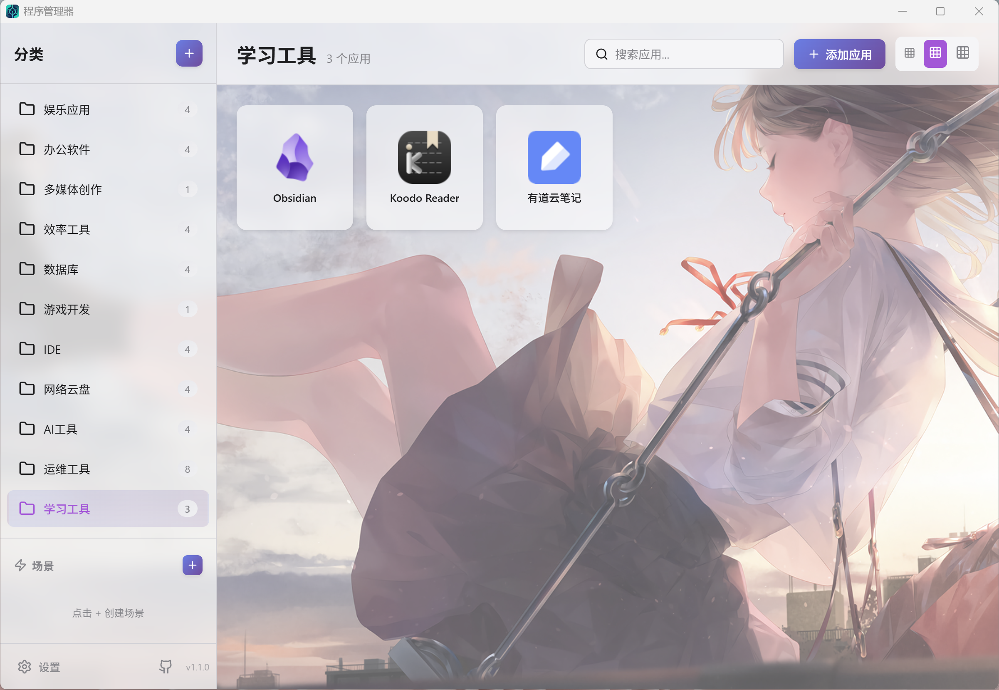
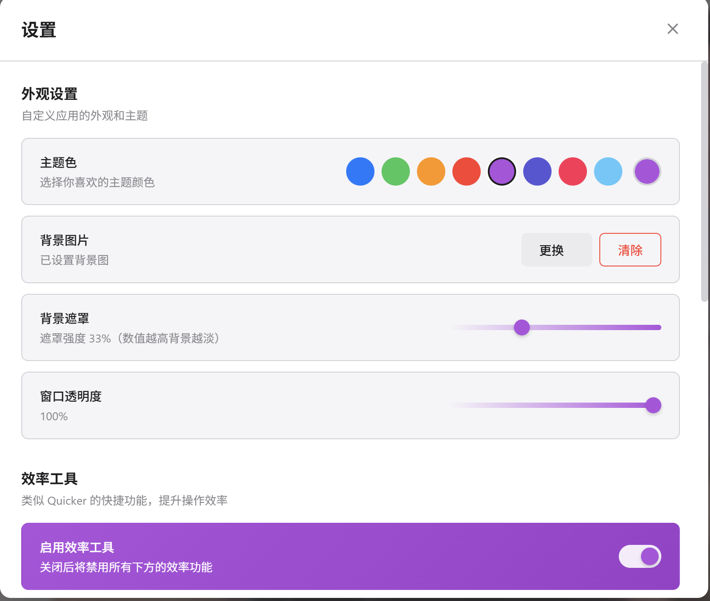

<div align="center">

# Program Manager

**简洁高效的程序启动器 & 效率工具**

[](https://github.com/yi124773651/program-manager/releases)
[](https://github.com/yi124773651/program-manager)

[](https://tauri.app/)
[](https://vuejs.org/)
[](https://www.typescriptlang.org/)
[](https://www.rust-lang.org/)
[](https://vitejs.dev/)
[](https://pinia.vuejs.org/)

[](LICENSE)
[](https://www.microsoft.com/windows)

**[English](./docs/README_EN.md)** | 简体中文

</div>

---

## 📸 预览

<div align="center">
  
  
</div>

## ✨ 特性

### 核心功能
- 🚀 **轻量快速** - 安装包仅 3-5MB，比 Electron 应用小 90%
- ⚡ **极速启动** - 冷启动 < 0.5s，内存占用 30-50MB
- 🎨 **现代界面** - macOS 风格 UI，支持亮色/暗色主题
- 📊 **智能排序** - 最近使用的应用自动置顶
- 🖱️ **拖拽操作** - 批量添加应用，拖拽排序
- 💻 **系统集成** - 系统托盘、单实例运行、右键菜单

### 效率工具
- 🎬 **场景工作流** - 一键执行多个操作，支持 8 种动作类型
- 📋 **剪贴板历史** - 自动记录剪贴板内容，支持置顶
- 🔍 **快捷搜索** - Spotlight 风格的全局搜索
- 📝 **快捷便签** - 随时记录灵感和待办事项
- 🧮 **计算器增强** - 在搜索框中直接计算表达式
- 🎨 **个性化** - 自定义主题色、背景图片、窗口透明度

## 🎬 场景功能

场景是一组可以一键执行的动作序列，类似于 Quicker 的动作组合。

### 支持的动作类型

| 动作 | 说明 |
|------|------|
| 🚀 启动程序 | 从已添加的应用中选择并启动 |
| 🛡️ 管理员启动 | 以管理员权限启动程序 |
| 🌐 打开网页 | 在浏览器中打开指定网址 |
| 📂 打开文件夹 | 在资源管理器中打开指定目录 |
| 📄 打开文件 | 使用默认程序打开指定文件 |
| ❌ 关闭程序 | 结束指定程序的所有进程 |
| ⏱️ 延迟等待 | 等待指定秒数后继续 |
| 🔔 发送通知 | 显示 Windows 系统通知 |

### 使用示例

**工作场景**：一键启动 VS Code、打开项目文件夹、启动本地服务器

**娱乐场景**：启动游戏平台、打开游戏论坛、关闭工作软件

## 🛠️ 快速开始

### 环境要求

- Node.js 18+
- Rust 1.70+

### 开发模式

```bash
# 安装依赖
npm install

# 启动开发服务器
npm run tauri dev
```

### 构建发布

```bash
npm run tauri build
```

构建产物位于：`src-tauri/target/release/bundle/`

### Windows 脚本

| 脚本 | 说明 |
|------|------|
| `scripts/dev.bat` | 启动开发模式 |
| `scripts/build.bat` | 构建发布版本 |
| `scripts/clean-debug-only.bat` | 清理调试构建 |

## 📖 使用指南

### 基础操作

1. **创建分类** - 点击侧边栏的 `+` 按钮
2. **添加应用** - 将 `.exe` 或 `.lnk` 文件拖入应用区域
3. **启动程序** - 点击应用卡片
4. **管理应用** - 右键点击查看选项（移动、删除、打开位置）
5. **调整顺序** - 拖拽排序应用或分类

### 场景工作流

1. **创建场景** - 点击侧边栏场景区域的 `+` 按钮
2. **添加动作** - 在场景编辑器中点击"添加动作"
3. **配置参数** - 选择应用、输入网址或路径
4. **调整顺序** - 拖拽动作调整执行顺序
5. **执行场景** - 点击场景即可一键执行所有动作

### 应用快捷动作

右键点击应用卡片可使用以下快捷动作：

| 动作 | 说明 |
|------|------|
| 打开所在文件夹 | 在资源管理器中定位文件 |
| 复制文件路径 | 复制完整路径到剪贴板 |
| 以管理员身份运行 | 提升权限启动 |
| 结束进程 | 强制关闭程序 |

### ⚙️ 设置选项

| 选项 | 可选值 |
|------|--------|
| 卡片大小 | 小 / 中 / 大 |
| 主题 | 亮色 / 暗色 / 跟随系统 |
| 主题色 | 8 种预设颜色可选 |
| 背景图片 | 自定义背景图片 |
| 窗口透明度 | 0% - 100% |
| 排序方式 | 最近使用 / 名称 / 自定义 |

### 效率工具开关

| 功能 | 快捷键 | 说明 |
|------|--------|------|
| 剪贴板历史 | - | 自动记录剪贴板内容 |
| 快捷搜索 | Ctrl+K | Spotlight 风格搜索 |
| 快捷便签 | Alt+N | 快速记录笔记 |
| 计算器 | - | 搜索框中直接计算 |

## 🏗️ 技术栈

<table>
  <tr>
    <th>前端</th>
    <th>后端</th>
  </tr>
  <tr>
    <td>
      <br/>
      <br/>
      <br/>
      
    </td>
    <td>
      <br/>
      <br/>
      
    </td>
  </tr>
</table>

## 📁 项目结构

```
program-manager/
├── src/                    # Vue 前端
│   ├── components/         # UI 组件
│   │   ├── AppCard.vue          # 应用卡片
│   │   ├── CategoryList.vue     # 分类列表
│   │   ├── SceneEditor.vue      # 场景编辑器
│   │   ├── ClipboardHistory.vue # 剪贴板历史
│   │   ├── SpotlightSearch.vue  # 快捷搜索
│   │   ├── QuickNotes.vue       # 快捷便签
│   │   └── SettingsDialog.vue   # 设置对话框
│   ├── stores/             # Pinia 状态管理
│   │   ├── appStore.ts          # 应用状态
│   │   ├── scenesStore.ts       # 场景状态
│   │   ├── clipboardStore.ts    # 剪贴板状态
│   │   └── actionsStore.ts      # 动作状态
│   ├── types/              # TypeScript 类型定义
│   └── views/              # 视图
├── src-tauri/              # Rust 后端
│   └── src/
│       ├── commands/       # Tauri 命令
│       ├── models/         # 数据模型
│       └── utils/          # 工具函数
└── scripts/                # 构建脚本
```

## 🗺️ 路线图

- [x] 分类与应用管理
- [x] 拖拽支持
- [x] 自动提取图标
- [x] 主题切换
- [x] 系统托盘
- [x] 场景工作流
- [x] 剪贴板历史
- [x] 快捷搜索
- [x] 快捷便签
- [x] 自定义主题色
- [x] 背景图片
- [ ] 使用统计
- [ ] 全局热键
- [ ] 导入/导出

## ❓ 常见问题

<details>
<summary><b>为什么启动这么快？</b></summary>
<br/>
Tauri 使用系统原生 WebView 而非打包 Chromium，且 Rust 二进制文件启动几乎是即时的。
</details>

<details>
<summary><b>配置文件存储在哪里？</b></summary>
<br/>
Windows: <code>%APPDATA%/program-manager/config.json</code>
</details>

<details>
<summary><b>关闭窗口会退出应用吗？</b></summary>
<br/>
不会，窗口会最小化到系统托盘。右键点击托盘图标 → 退出 即可完全退出。
</details>

<details>
<summary><b>场景数据存储在哪里？</b></summary>
<br/>
场景数据存储在浏览器的 localStorage 中，键名为 <code>app_scenes_config</code>。
</details>

## 📄 许可证

[MIT](LICENSE)

## 🙏 致谢

- [Tauri](https://tauri.app/) - 构建更小、更快、更安全的桌面应用
- [Vue 3](https://vuejs.org/) - 渐进式 JavaScript 框架
- [Pinia](https://pinia.vuejs.org/) - Vue 状态管理
- [Lucide Icons](https://lucide.dev/) - 精美的开源图标库
- [SortableJS](https://sortablejs.github.io/Sortable/) - 拖拽排序库

---

<div align="center">

如果这个项目对你有帮助，欢迎 ⭐ Star 支持一下！

</div>
