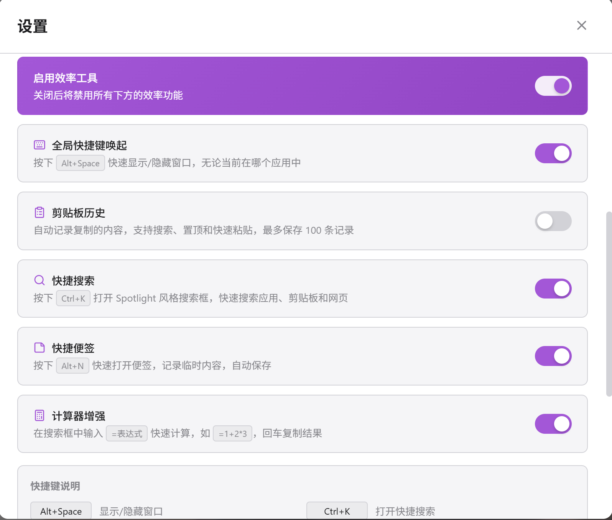
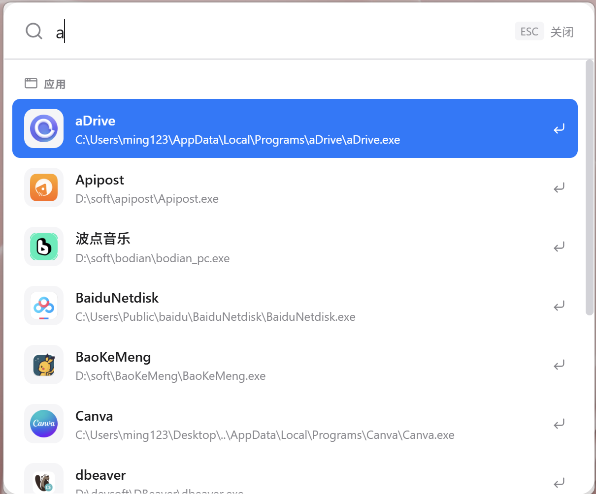
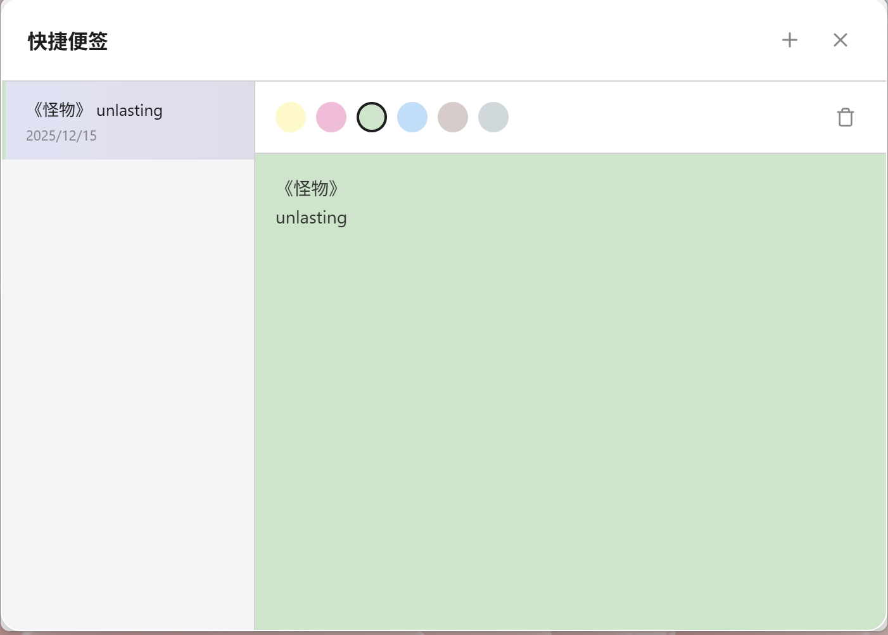
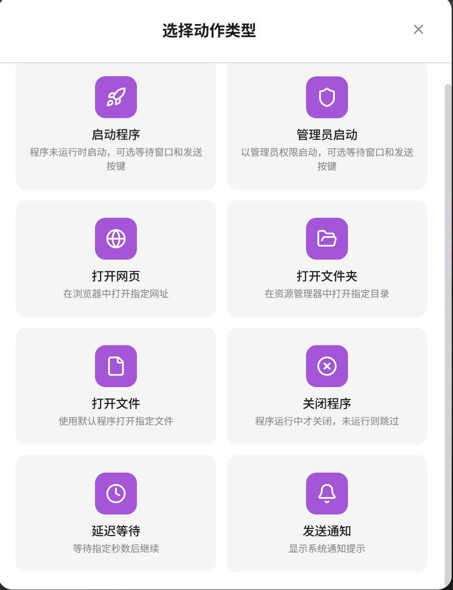

<div align="center">

# Program Manager

**A Modern, Lightweight Application Launcher & Productivity Tool**

[](https://github.com/yi124773651/program-manager/releases)
[](https://github.com/yi124773651/program-manager)

[](https://tauri.app/)
[](https://vuejs.org/)
[](https://www.typescriptlang.org/)
[](https://www.rust-lang.org/)
[](https://vitejs.dev/)
[](https://pinia.vuejs.org/)

[](../LICENSE)
[](https://www.microsoft.com/windows)

English | **[简体中文](../README.md)**

</div>

---

## 📸 Preview

### Main Interface & Settings

<div align="center">
  
  
</div>

### Productivity Tools

<div align="center">
  
  
  
</div>

### Scene Workflow

<div align="center">
  
  
</div>

### Maintenance Tools

<div align="center">
  
</div>

## ✨ Features

### Core Features
- 🚀 **Lightweight** - Only 3-5MB installer, 90% smaller than Electron apps
- ⚡ **Fast** - Cold start < 0.5s, memory usage 30-50MB
- 🎨 **Modern UI** - macOS-style interface with light/dark theme
- 📊 **Smart Sorting** - Recently used apps automatically move to top
- 🖱️ **Drag & Drop** - Batch add apps, drag to reorder
- 💻 **System Integration** - System tray, single instance, context menu

### Productivity Tools
- 🎬 **Scene Workflow** - Execute multiple actions with one click, supports 8 action types
- 📋 **Clipboard History** - Auto-record clipboard content, supports pinning
- 🔍 **Quick Search** - Spotlight-style global search
- 📝 **Quick Notes** - Record ideas and to-dos anytime
- 🧮 **Calculator** - Calculate expressions directly in search box
- 🎨 **Personalization** - Custom theme color, background image, window opacity

### Maintenance Tools
- 🧹 **Clean Invalid Items** - One-click detection of invalid programs, batch delete invalid icons
- 🔄 **Update Detection** - Smart update detection with version number and file metadata hybrid approach

## 🎬 Scene Feature

Scenes are action sequences that can be executed with one click, similar to Quicker's action combinations.

### Supported Action Types

| Action | Description |
|--------|-------------|
| 🚀 Launch App | Select and launch from added applications |
| 🛡️ Run as Admin | Launch program with administrator privileges |
| 🌐 Open URL | Open specified URL in browser |
| 📂 Open Folder | Open specified directory in Explorer |
| 📄 Open File | Open specified file with default program |
| ❌ Close App | Terminate all processes of specified program |
| ⏱️ Delay | Wait for specified seconds before continuing |
| 🔔 Send Notification | Display Windows system notification |

### Usage Examples

**Work Scene**: One-click to launch VS Code, open project folder, start local server

**Entertainment Scene**: Launch game platform, open game forum, close work software

## 🛠️ Quick Start

### Prerequisites

- Node.js 18+
- Rust 1.70+

### Development

```bash
# Install dependencies
npm install

# Start dev server
npm run tauri dev
```

### Build

```bash
npm run tauri build
```

Output: `src-tauri/target/release/bundle/`

### Windows Scripts

| Script | Description |
|--------|-------------|
| `scripts/dev.bat` | Start dev mode |
| `scripts/build.bat` | Build release |
| `scripts/clean-debug-only.bat` | Clean debug builds |

## 📖 Usage Guide

### Basic Operations

1. **Create Category** - Click `+` in sidebar
2. **Add Apps** - Drag `.exe` or `.lnk` files to app area
3. **Launch** - Click app card
4. **Manage** - Right-click for options (move, delete, open location)
5. **Reorder** - Drag to sort apps or categories

### Scene Workflow

1. **Create Scene** - Click `+` in scene area of sidebar
2. **Add Actions** - Click "Add Action" in scene editor
3. **Configure** - Select app, enter URL or path
4. **Reorder** - Drag actions to adjust execution order
5. **Execute** - Click scene to execute all actions

### App Quick Actions

Right-click app card for quick actions:

| Action | Description |
|--------|-------------|
| Open Location | Locate file in Explorer |
| Copy Path | Copy full path to clipboard |
| Run as Admin | Launch with elevated privileges |
| Kill Process | Force close program |

### Maintenance Tools

Click the "Maintenance" button at the bottom of the sidebar or open it from settings:

#### Clean Invalid Items
1. Click "Start Detection" to scan all programs
2. View invalid program list (❌ File not found, ⚠️ Network path unreachable)
3. Click "Batch Delete Invalid Items" for one-click cleanup

#### Update Detection
1. First use requires clicking "Initialize Now" to establish baseline data
2. Click "Start Update Detection" to scan for program updates
3. View update list with confidence levels:
   - 🔵 **High Confidence** - Registry version number changed
   - 🟡 **Medium Confidence** - Both file size and modification time changed
   - ⚪ **Low Confidence** - Only modification time changed

### ⚙️ Settings

| Option | Values |
|--------|--------|
| Card Size | Small / Medium / Large |
| Theme | Light / Dark / Auto |
| Theme Color | 8 preset colors |
| Background | Custom background image |
| Window Opacity | 0% - 100% |
| Sort | Recent / Name / Custom |

### Productivity Tool Switches

| Feature | Shortcut | Description |
|---------|----------|-------------|
| Clipboard History | - | Auto-record clipboard content |
| Quick Search | Ctrl+K | Spotlight-style search |
| Quick Notes | Alt+N | Quick note recording |
| Calculator | - | Calculate in search box |

## 🏗️ Tech Stack

<table>
  <tr>
    <th>Frontend</th>
    <th>Backend</th>
  </tr>
  <tr>
    <td>
      <br/>
      <br/>
      <br/>
      
    </td>
    <td>
      <br/>
      <br/>
      
    </td>
  </tr>
</table>

## 📁 Project Structure

```
program-manager/
├── src/                    # Vue frontend
│   ├── components/         # UI components
│   │   ├── AppCard.vue          # App card
│   │   ├── CategoryList.vue     # Category list
│   │   ├── SceneEditor.vue      # Scene editor
│   │   ├── ClipboardHistory.vue # Clipboard history
│   │   ├── SpotlightSearch.vue  # Quick search
│   │   ├── QuickNotes.vue       # Quick notes
│   │   ├── MaintenancePanel.vue # Maintenance panel
│   │   └── SettingsDialog.vue   # Settings dialog
│   ├── stores/             # Pinia state management
│   │   ├── appStore.ts          # App state
│   │   ├── scenesStore.ts       # Scene state
│   │   ├── clipboardStore.ts    # Clipboard state
│   │   ├── maintenanceStore.ts  # Maintenance state
│   │   └── actionsStore.ts      # Actions state
│   ├── types/              # TypeScript type definitions
│   └── views/              # Views
├── src-tauri/              # Rust backend
│   └── src/
│       ├── commands/       # Tauri commands
│       ├── models/         # Data models
│       └── utils/          # Utilities
│           ├── app_validator.rs # App validation
│           └── update_checker.rs # Update detection
└── scripts/                # Build scripts
```

## 🗺️ Roadmap

- [x] Category & app management
- [x] Drag & drop support
- [x] Auto icon extraction
- [x] Theme switching
- [x] System tray
- [x] Scene workflow
- [x] Clipboard history
- [x] Quick search
- [x] Quick notes
- [x] Custom theme color
- [x] Background image
- [x] Clean invalid items
- [x] Update detection
- [ ] Usage statistics
- [ ] Global hotkeys
- [ ] Import/Export

## ❓ FAQ

<details>
<summary><b>Why is it so fast?</b></summary>
<br/>
Tauri uses native WebView instead of bundled Chromium, and Rust binaries start instantly.
</details>

<details>
<summary><b>Where is config stored?</b></summary>
<br/>
Windows: <code>%APPDATA%/program-manager/config.json</code>
</details>

<details>
<summary><b>Does closing window exit the app?</b></summary>
<br/>
No, it minimizes to system tray. Right-click tray icon → Exit to quit.
</details>

<details>
<summary><b>Where is scene data stored?</b></summary>
<br/>
Scene data is stored in browser's localStorage with key <code>app_scenes_config</code>.
</details>

## 📄 License

[MIT](../LICENSE)

## 🙏 Acknowledgments

- [Tauri](https://tauri.app/) - Build smaller, faster, and more secure desktop apps
- [Vue 3](https://vuejs.org/) - The Progressive JavaScript Framework
- [Pinia](https://pinia.vuejs.org/) - Intuitive Vue Store
- [Lucide Icons](https://lucide.dev/) - Beautiful open-source icons
- [SortableJS](https://sortablejs.github.io/Sortable/) - Drag and drop library

---

<div align="center">

If you find this project helpful, please consider giving it a ⭐ Star!

</div>
